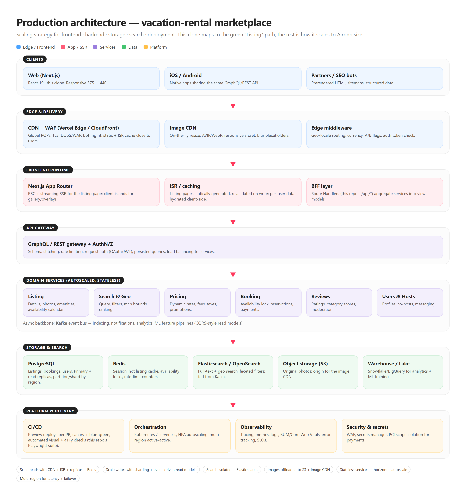
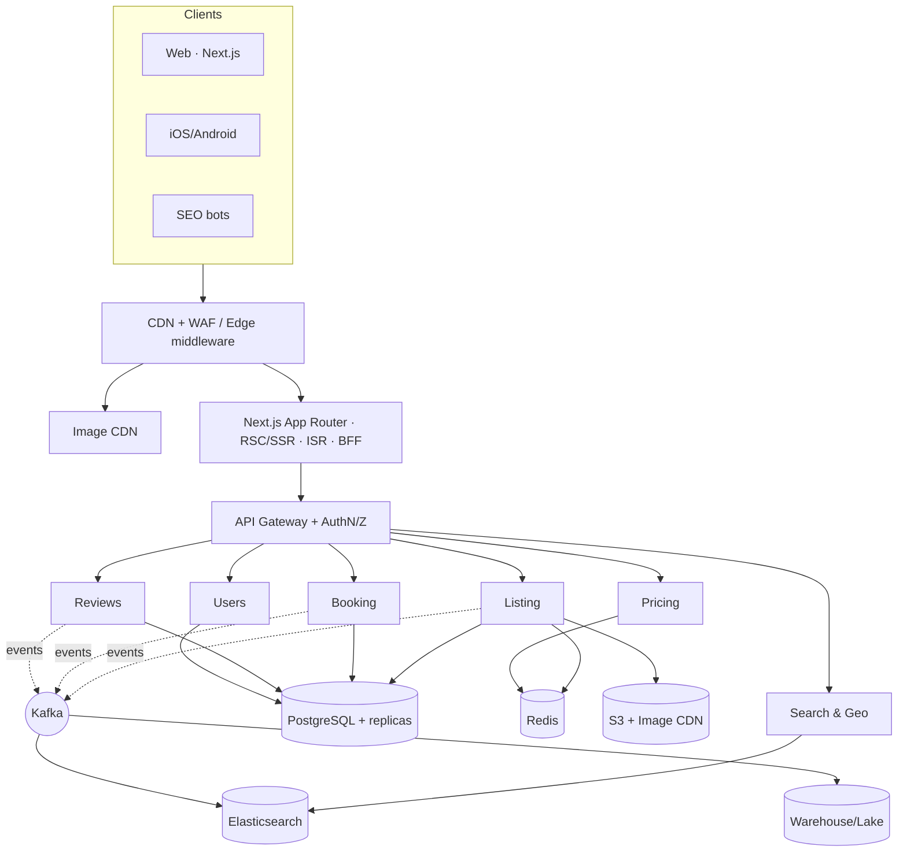

# Production architecture — vacation-rental marketplace

The rendered diagram above (`architecture.png`, source `architecture.html`) shows the
full picture. This document explains the **scaling strategy** per layer. The clone in
this repo implements the green *Listing* read-path end to end; everything else is how
that path scales to Airbnb size.

## Frontend
- **Next.js on a global edge/CDN (Vercel).** Listing pages are largely static and
  read-heavy, so they are **statically generated + ISR** — rebuilt on write, served
  from the POP nearest the user. Personalized bits (saved state, prices for the user's
  dates) hydrate as **client islands** (the gallery, overlays, booking card) over
  streamed **RSC/SSR** HTML.
- **Image CDN.** Photos dominate bytes on this page. Originals live in object storage;
  a dedicated image CDN does on-the-fly resize, **AVIF/WebP**, responsive `srcset`, and
  blur placeholders. In the clone the photos are bundled under `/public/photos`; in
  production the same ``/manifest contract points at the CDN.
- **Edge middleware** handles geo/locale/currency routing, A/B flags, and a cheap auth
  token check before origin.

## Backend
- **API gateway (GraphQL/REST)** terminates auth (OAuth/JWT), rate-limits, and fans out
  to **stateless domain services** (Listing, Search, Pricing, Booking, Reviews, Users)
  that **autoscale horizontally** behind it. In the clone, the Next.js **Route
  Handlers** (`/api/listing`, `/api/photos`) play the BFF role — aggregating a view
  model for the page.
- **Event-driven backbone (Kafka).** Writes emit events; consumers build **read models**
  (CQRS) — search indexing, notifications, analytics, ML features — so the read path
  stays fast and decoupled from writes.

## Storage
- **PostgreSQL** for source-of-truth entities (listings, bookings, users): a primary for
  writes, **read replicas** for reads, **partitioned/sharded by region** as volume grows.
- **Redis** for sessions, hot-listing cache, availability locks, and rate-limit counters.
- **Object storage (S3)** for original photos → origin for the image CDN.
- **Warehouse/lake** (Snowflake/BigQuery) for analytics and ML training, fed off Kafka.

## Search
- **Elasticsearch/OpenSearch** owns full-text + **geo** queries and faceted filters,
  kept in sync from the event bus. Isolating search from the transactional DB lets each
  scale independently — the DB never serves free-text/geo scans.

## Deployment
- **CI/CD** with per-PR preview deploys and **canary + blue-green** rollouts. The repo's
  Playwright suite (`tools/a11y-check.mjs`, `tools/shoot-clone.mjs`) runs **automated
  visual + accessibility gates** in the pipeline.
- **Orchestration** on Kubernetes/serverless with HPA autoscaling, **multi-region
  active-active** for latency and failover.
- **Observability**: distributed tracing, metrics, logs, **RUM/Core Web Vitals**, error
  tracking, and SLOs. **Security**: WAF, secrets manager, PCI-scope isolation for payments.

## Scaling summary
| Pressure | Strategy |
|---|---|
| Read traffic | CDN + ISR + Postgres read replicas + Redis |
| Write traffic | Sharding + event-driven read models (CQRS) |
| Search load | Dedicated Elasticsearch cluster |
| Media | Object storage + image CDN, responsive formats |
| Compute | Stateless services, horizontal autoscale |
| Latency / HA | Multi-region active-active |

## Editable source (Mermaid)

